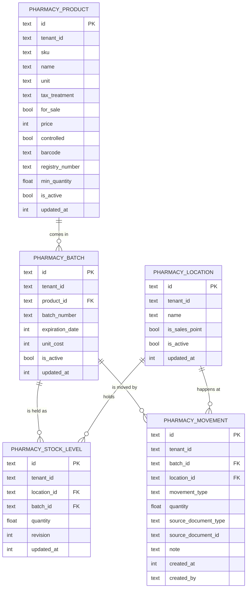

# Database

```mermaid
erDiagram
    PHARMACY_PRODUCT ||--o{ PHARMACY_BATCH : "comes in"
    PHARMACY_BATCH ||--o{ PHARMACY_STOCK_LEVEL : "is held as"
    PHARMACY_LOCATION ||--o{ PHARMACY_STOCK_LEVEL : "holds"
    PHARMACY_BATCH ||--o{ PHARMACY_MOVEMENT : "is moved by"
    PHARMACY_LOCATION ||--o{ PHARMACY_MOVEMENT : "happens at"
    PHARMACY_PRODUCT {
        text id PK
        text tenant_id
        text sku
        text name
        text unit
        text tax_treatment
        bool for_sale
        int price
        bool controlled
        text barcode
        text registry_number
        float min_quantity
        bool is_active
        int updated_at
    }
    PHARMACY_LOCATION {
        text id PK
        text tenant_id
        text name
        bool is_sales_point
        bool is_active
        int updated_at
    }
    PHARMACY_BATCH {
        text id PK
        text tenant_id
        text product_id FK
        text batch_number
        int expiration_date
        int unit_cost
        bool is_active
        int updated_at
    }
    PHARMACY_STOCK_LEVEL {
        text id PK
        text tenant_id
        text location_id FK
        text batch_id FK
        float quantity
        int revision
        int updated_at
    }
    PHARMACY_MOVEMENT {
        text id PK
        text tenant_id
        text batch_id FK
        text location_id FK
        text movement_type
        float quantity
        text source_document_type
        text source_document_id
        text note
        int created_at
        text created_by
    }
```
